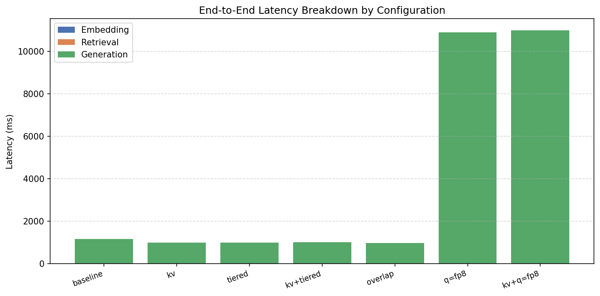
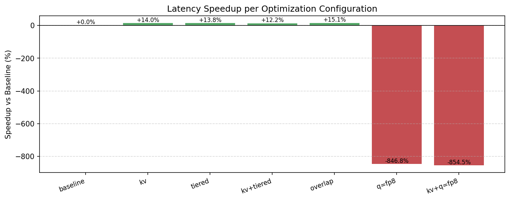
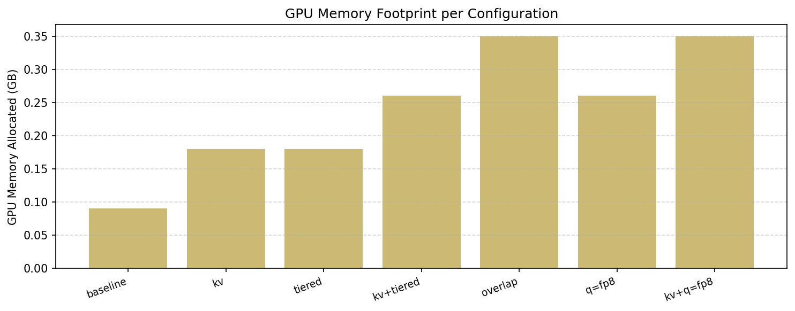

# HPML Project

https://github.com/vetsasp/HPML-Final-Project

Philip Vetsas - pmv264@nyu.edu

Aryaman Chakraborty - ac11927@nyu.edu

Mansour Ndiaye - mv2330@nyu.edu

Dongting Gao - dg4528@nyu.edu

Dependencies are managed with `uv`.

## Project Overview

This project studies the performance of a GPU-based Retrieval-Augmented Generation (RAG) pipeline and explores how hardware-aware optimizations affect end-to-end latency.

The implemented system takes a user query, embeds it with a sentence-transformer model, retrieves relevant passages from a FAISS-backed vector index, builds a grounded prompt, and generates a final answer with a language model through vLLM.

The repository also includes benchmark and evaluation utilities for testing several optimization paths:

- KV prefix caching
- tiered KV cache management
- retrieval-generation overlap for multi-query workloads
- quantization experiments

## Milestones

| Milestone | Status | Notes |
| --- | --- | --- |
| Baseline RAG pipeline | Complete | End-to-end embed -> retrieve -> generate flow is implemented. |
| Benchmark harness | Complete | `src.test_runner` compares baseline and optimization configurations. |
| KV prefix caching | Complete | Wired through vLLM `enable_prefix_caching`. |
| Tiered KV framework | Partial | Prompt blocks and GPU/CPU/disk residency metadata are implemented, but not true per-block KV tensor import/export through vLLM. |
| Overlap | Partial | Implemented as multi-query pipelining in `Pipeline.query_batch()`, not single-query overlap. |
| Quantization experiments | Complete | Benchmark support exists for `fp8` and other vLLM quantization flags. |
| Quality evaluation | Complete | `src.eval_quality` computes ROUGE-L and writes `quality_results.json` for plotting. |
| Plot generation | Complete | `src.plot_results` renders benchmark plots from JSON artifacts. |

## Repository Structure

- `src/__main__.py`: CLI entrypoint.
- `src/pipeline.py`: main orchestration layer.
- `src/embedder.py`: sentence-transformer embedding wrapper.
- `src/retriever.py`: FAISS retrieval and in-memory document lookup.
- `src/generator.py`: vLLM generation wrapper and prompt formatting.
- `src/kv_cache_manager.py`: tiered KV cache metadata and residency tracking.
- `src/prompt_blocks.py`: cacheable prompt block representation.
- `src/test_runner.py`: benchmark harness for optimization comparisons.
- `src/eval_quality.py`: ROUGE-L quality evaluation script.
- `src/plot_results.py`: plotting utility for benchmark/evaluation artifacts.
- `src/utils.py`: logging, timing, memory helpers, and dependency check.
- `data/corpus.jsonl`: default corpus loaded by the pipeline.
- `test_imports/`: smoke tests for import/path validation.
- `hpc_run/`: HPC benchmark output and generated plots.

## Example Commands

Single query:

`uv run python -m src "What is retrieval-augmented generation?"`

Interactive mode:

`uv run python -m src`

Run dependency check:

`uv run python -m src.utils`

Run the benchmark matrix:

`uv run python -m src.test_runner`

Run quality evaluation:

`uv run python -m src.eval_quality`

Generate plots from JSON results:

`uv run python -m src.plot_results`

## Results

The table below is copied from the benchmark artifact in `hpc_run/benchmark_results.json` for the captured run on an `NVIDIA L4` using `Qwen/Qwen2-0.5B-Instruct`.

| Configuration | Embed (ms) | Retrieve (ms) | Generate (ms) | Total (ms) | Speedup % | GPU Memory (GB) |
| --- | ---: | ---: | ---: | ---: | ---: | ---: |
| baseline | 7.32 | 0.0477 | 1142.73 | 1150.36 | 0.00 | 0.09 |
| kv | 7.30 | 0.0380 | 981.51 | 989.08 | 14.02 | 0.18 |
| tiered | 7.19 | 0.0383 | 973.55 | 991.70 | 13.79 | 0.18 |
| kv+tiered | 7.12 | 0.0379 | 993.75 | 1010.23 | 12.18 | 0.26 |
| overlap | 3.27 | 0.0529 | 973.49 | 977.23 | 15.05 | 0.35 |
| q=fp8 | 7.26 | 0.0412 | 10884.51 | 10892.05 | -846.84 | 0.26 |
| kv+q=fp8 | 7.07 | 0.0425 | 10973.09 | 10980.42 | -854.52 | 0.35 |

### Charts

## Observations

- Generation dominates total latency.
- In this captured HPC run, `overlap` produced the best latency result at about 15% speedup over baseline.
- `kv`, `tiered`, and `kv+tiered` all improved latency by roughly 12-14%, suggesting that caching-oriented optimizations help on this workload even though retrieval itself is still cheap.
- `fp8` performed dramatically worse on this hardware/model combination in the captured run.
- GPU memory usage rose as additional caching and overlap mechanisms were enabled.
